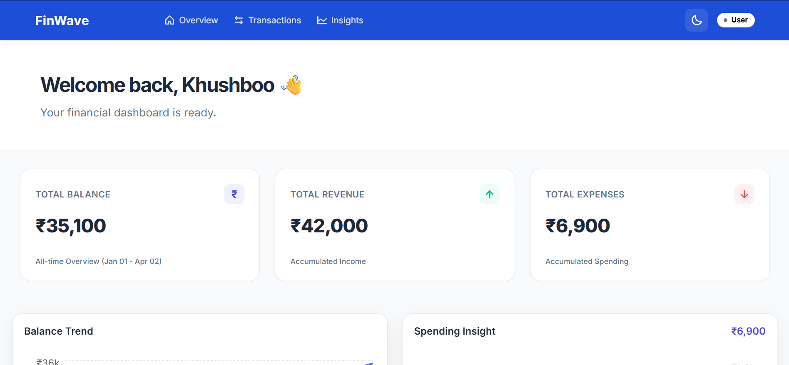
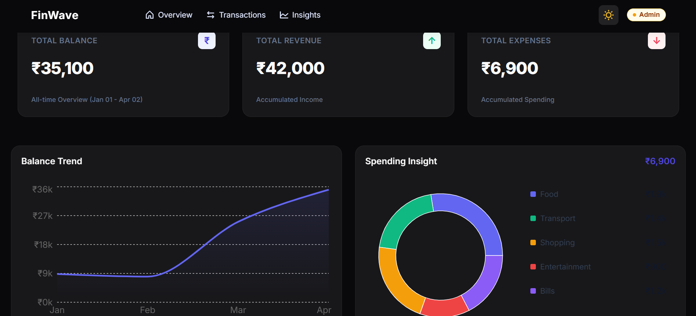

# FinWave | Advanced Finance Dashboard

FinWave is a high-performance financial dashboard focused on **scalable architecture, responsive design, and intuitive user interaction**.  
It includes an enterprise-level **Role-Based Access Control (RBAC)** system along with real-time financial safeguards.

## 🛠️ Tech Stack

- **React**  
  Component-based UI for building a scalable and dynamic interface  

- **Recharts**  
  Composable charting library for interactive balance trends and spending breakdowns. 

- **JavaScript (ES6+)**  
  Core application logic, asynchronous data fetching, and state management.

- **CSS3**  
  Custom styling with responsive design and dark mode support  

- **LocalStorage**  
  Client-side data persistence for transactions and user preferences  

## ✨ Key Features

### 📊 Dashboard Overview

- **Live API Synchronization**
  Fetches real-time transaction data with built-in loading and error handling.
  
- **Real-time Summary**  
  Instantly view Total Balance, Total Income, and Total Expenses  

- **Balance Trend**  
  interactive line chart showing running net balance  

- **Spending Breakdown**  
  Donut chart to analyze expenses by category  

### 💳 Transaction Management
- Add and manage transactions  
- Filter and search transactions efficiently  
- Organized by category and type (Income / Expense)  

### 🎭 Role-Based UI
- **Viewer Mode** → Read-only access  
- **Admin Mode** → Add and manage transactions  
- Smooth role switching with consistent layout  

### 🧠 AI-Powered Insights
- Highlights spending patterns  
- Identifies top expense categories  
- Provides useful financial observations  

### 🌗 User Experience & Enhancements
- Fully responsive across all devices  
- Dark mode support  
- Local storage persistence  
- Smooth animations and transitions  
- Handles empty and no-data states gracefully  

### 🎭 Motion & UX Engineering
- **Lazy Loading Rows** → Animations trigger only when visible  
- **RBAC Symmetry (Ghost Column)** → Prevents layout shifts  
- **Smooth Transitions** → Uses `circOut` easing for fluid UI  

### 🔍 Data Handling
- Smart filtering (Category + Type)  
- No results state handling  
- Dynamic pagination with scroll reset  

## 🧠 Role-Based Access (RBAC)

### Viewer
- View transactions and charts  
- Search and filter data  
- No edit permissions  

### Admin
- Add transactions  
- Delete transactions  
- Full control over data  

### Switching Roles
Use the **Shield / Eye toggle** in the NavBar  

## 🎯 Design Principles

- Zero layout shift  
- Smooth performance-first animations  
- Clean and predictable state flow  
- Fully responsive UI

 ## 🌐 Live Preview

Check out the live version of FinWave:

🔗 **Live Demo:** https://khushboo992.github.io/FinWave/

## 📸 Screenshots

### 🏠 Dashboard Overview

### 📊 Charts & Analytics

## 👤 Author

**Khushboo Rawat**  
Focused on Motion Design, RBAC Systems, and Financial UX Engineering  

